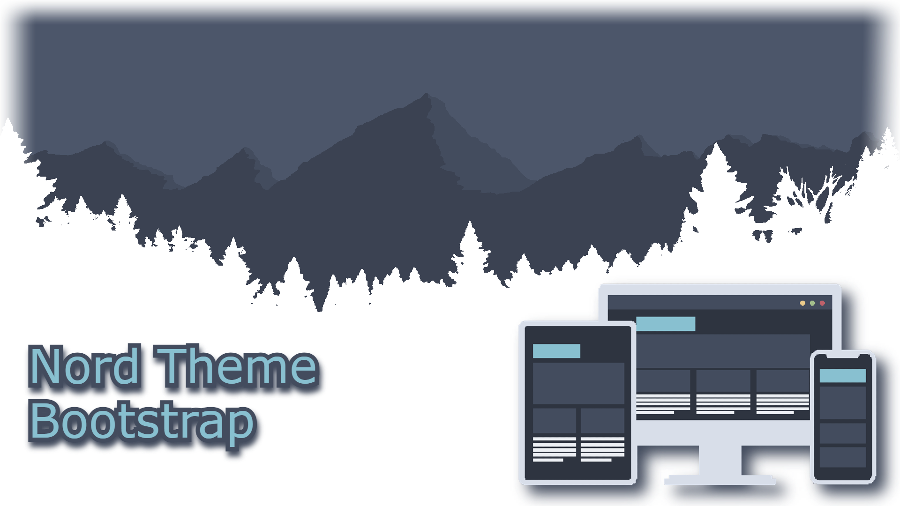
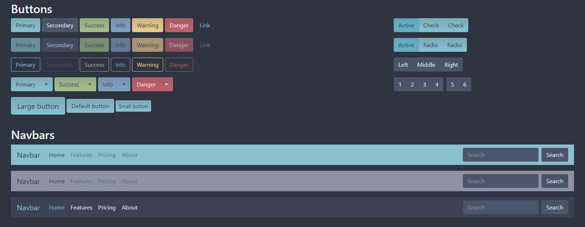
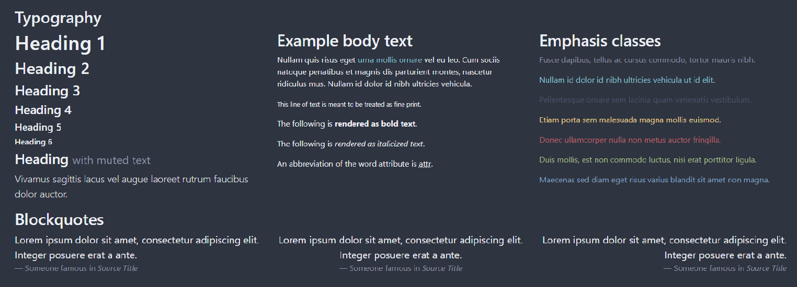
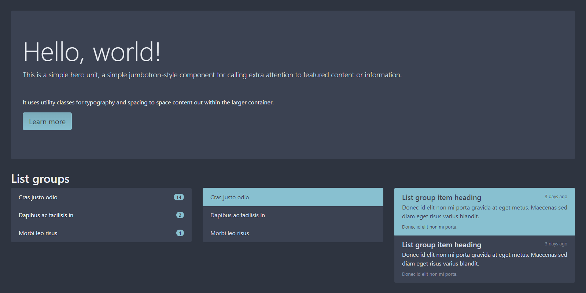
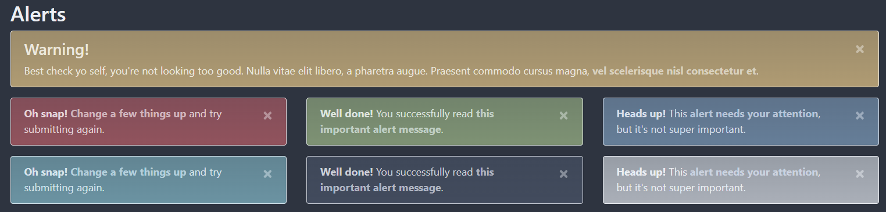
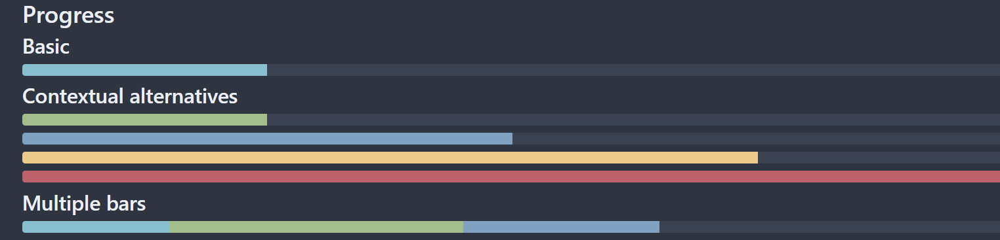
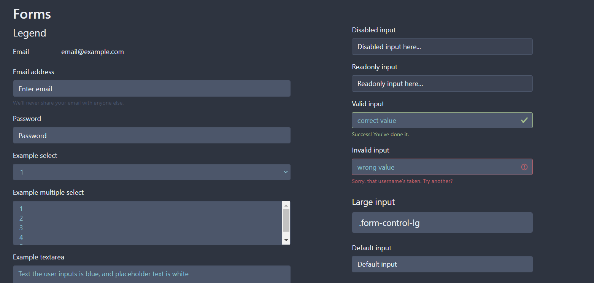
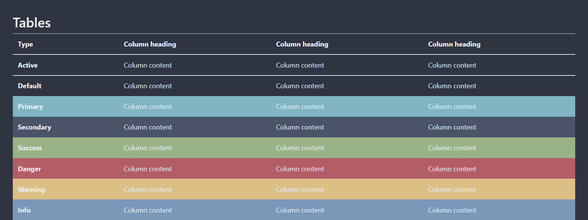
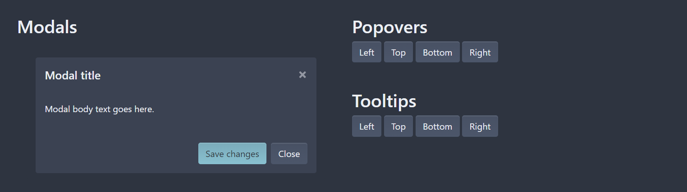
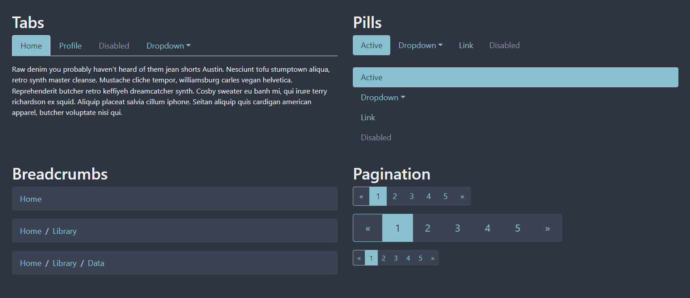

# ⚠️ The Current Branch, `v5`, is a work in progress, read [this](./WorkInProgressREADME.md) for more info! ⚠️

# Switch back to the `main` branch if you want to implement this repo into your project, the v5 branch is not stable or useable

# Bootstrap's CSS, modified to use the Nord color scheme!

What's Bootstrap? Visit [their website](https://getbootstrap.com/) for information and documentation about Bootstrap!

This is not a fork of Bootstrap, but rather a modified version of one specific part of bootstrap; it's CSS styles.

This is not a pull request or rejected contribution to Bootstrap, this is Bootstrap's CSS but modified to fit the "Nord" color scheme!

This is made to be used by developers that are creating responsive websites or webapps in the Nord color scheme. If you are trying to make a responsive website or webapp that does not use the Nord color scheme, then use the original [Bootstrap](https://getbootstrap.com/), not this recolored version of it!

## Screenshots

## How To Use
This section will be rewritten after migration to bootstrap version 5

## How to Contribute
Read [`contributing.md`](./CONTRIBUTING.md) on how to contribute!

If you've found a problem then [open an issue](https://github.com/SaberTooth-Studios/NordTheme-Bootstrap/issues)! Thanks! 😽

## Special Thanks To
[Arctic Ice Studio](https://github.com/arcticicestudio) & [Sven Greb](https://github.com/svengreb) for creating [Nord Theme](https://www.nordtheme.com/)! 🤩

[Bootstrap Team](https://getbootstrap.com/docs/5.1/about/team/) for creating [Bootstrap](https://getbootstrap.com/)! 😽

[Github](https://github.com/github) for creating [Github](https://github.com/)! 😄

Everyone that has contributed to or opened an issue in this repo! Thank you for helping improve this project! 🥰

And last but certainly not least; You for checking out this repo! 😸

## Licenses & Legal Information

This github repository and all it's contents are licensed under the MIT license. See the [license file](./LICENSE) for more details.

This github repository contains a modified version of Bootstrap. Bootstrap is licensed under the MIT license. See [Bootstrap's license file](./LICENSES/BootstrapLICENSE) for more details.

This github repository contains the Nord color scheme. Nord is licensed under the MIT license. See [Nord's license file](./LICENSES/NordLICENSE) for more details.

⚠️ **The MIT license requires you to keep license files included in your project. Links to license files are already inclided in the css and minfied css files. You may not remove the link to these licenses when used in your project. You do not need to manually attach any license files.**

👍 The MIT license lets you: modify the source code, download and use the contents of this repository in your own projects regardless of if they be personal, commercial, or private projects, and grant a sublicense to modify and distribute this repository's contents to third parties not included in the license,

⛔ The MIT license forbids you from: Holding the authors of this repository's contents and license owners liable for damages caused by your projects that include this repositories contents, including SaberTooth Studios Games's, Twitter's, Nord's, Bootstrap's, Arctic Ice Studios's, or Sven Greb's logos or names in a way that might state or imply that the listed companies, persons, orginizations, or groups have created, distrubuted, or are affliated with your project, or in a way that might state or imply that you created the projects owned by the listed companies, persons, orginizations, or groups.

### LEGAL INFO TL;DR

👉 **Do not remove links to licenses, Do not hold this repository liable for anything, Do not include this repo's artwork in your projects.**

**Anything else is fine; feel free to use this repo's contents in any of your projects! and feel free to modify this repo's source code!**

⚠️⚠️ **The only things in this repository that you can't use in your own projects are [`screenshots/banner.png`](./screenshots/banner.png) and [`screenshots/cover.png`](./screenshots/cover.png), only use those images for forks of this repo, not for any other projects!** ⚠️⚠️

Email me at sabertooth.studios.games@gmail.com for any questions or concerns! 👈     

### Cya Later 👋
