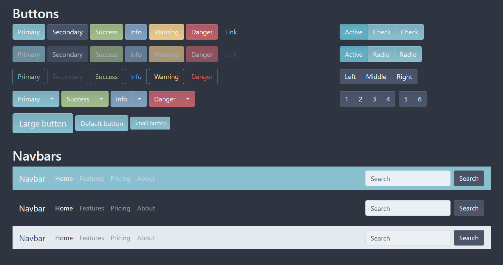
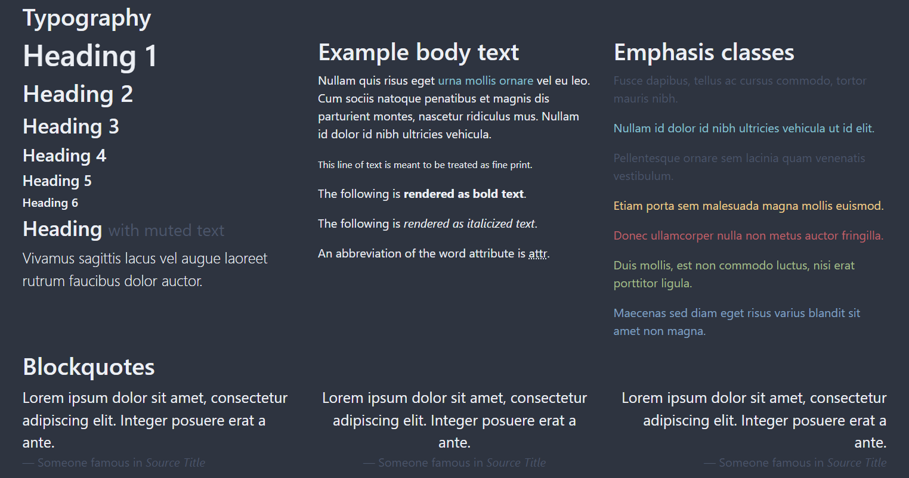
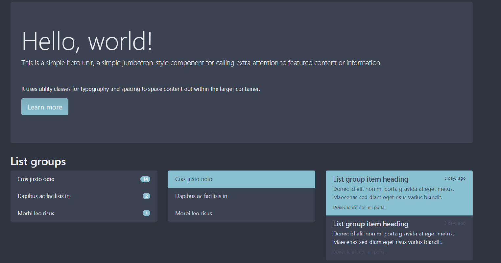
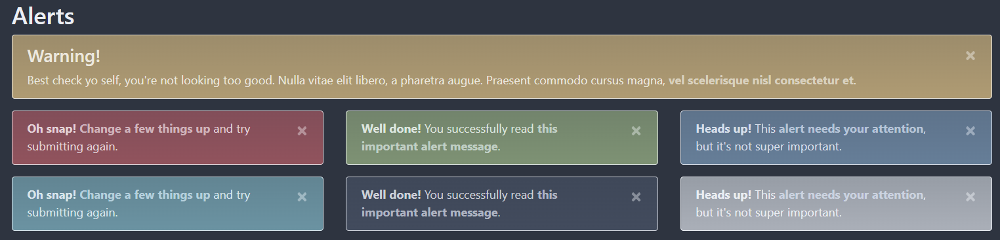
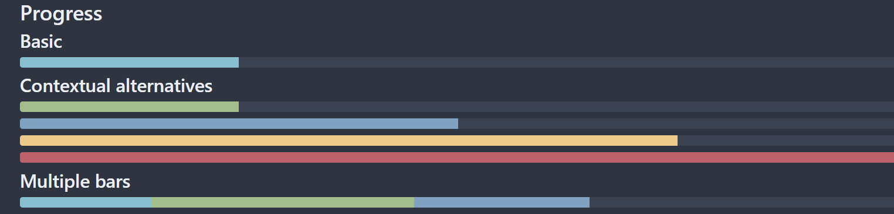

# NordTheme Bootstrap
This is Bootstrap's CSS, modified to use the Nord color scheme!

What's Bootstrap? Visit [their website](https://getbootstrap.com/) for information and documentation about Bootstrap!

This is not a fork of Bootstrap, but rather a modified version of one specific part of bootstrap; it's CSS styles.

This is not a pull request or rejected contribution to Bootstrap, this is Bootstrap's CSS but modified to fit the "Nord" color scheme!

This is made to be used by developers that are creating responsive websites or webapps in the Nord color scheme. If you are trying to make a responsive website or webapp that does not use the Nord color scheme, then use the original [Bootstrap](https://getbootstrap.com/), not this recolored version of it!

## Screenshots

## How To Use
First, download the CSS file found in this repo. Use the minified version; [`nordbootstrap.min.css`](./nordbootstrap.min.css), for any use other than debugging the CSS. (for debugging the css, use the pretty print file inclided in this repo; [`nordbootstrap.css`](./nordbootstrap.css))

👉 By the way, you can easily download individual files from the [releases tab](https://github.com/SaberTooth-Studios/NordTheme-Bootstrap/releases)

Next, link the downloaded css file to the `<head> </head>` html of your webpage, link it before any other css files you may use.

Then, follow [Bootstrap's documentation](https://getbootstrap.com/docs/5.1/getting-started/javascript/) on how to link their optional javascript files (these javascript libraries add extra functionality to your webpage, and are not required for your website to function properly) ⚠️ **DO NOT follow the CSS linking instructions from Bootstrap's documentation since you should only link this repo's CSS, which contains Bootstrap's original CSS but with modified colors** 

And, you're done! It's as simple as that! 😸

Now read [bootstrap's documentation](https://getbootstrap.com/docs/5.1/layout) on how to properly create elements on your page! Skip the "Getting Started" and "Customize" Sections of the documentation if you're using this recolor of bootstrap! 👈

⚠️ **This repo does NOT use the method of theming explained in [Bootstrap's Customization Documentation](https://getbootstrap.com/docs/5.1/customize/overview/) and instead combines Bootstrap's original CSS with the modifications into one file. So unlike what Bootstrap's Documentation might say, you do should NOT link Bootstrap's original CSS file along with this recolored version, since this repo's CSS already contains Bootstrap's original content in the same file as the modifications! You should still link Bootstrap's original JS libraries using the process described in [their documentation](https://getbootstrap.com/docs/5.1/getting-started/javascript)! You should NOT follow Bootstrap's CSS linking instructions if you want to use this repo's CSS!**

## How to Contribute
Read [`contributing.md`](./contributing.md) on how to contribute!

If you've found a problem then [open an issue](https://github.com/SaberTooth-Studios/NordTheme-Bootstrap/issues)! Thanks! 😽

## Special Thanks To
[Arctic Ice Studio](https://github.com/arcticicestudio) & [Sven Greb](https://github.com/svengreb) for creating [Nord Theme](https://www.nordtheme.com/)! 🤩

[Bootstrap Team](https://getbootstrap.com/docs/5.1/about/team/) for creating [Bootstrap](https://getbootstrap.com/)! 🥰

[Github](https://github.com/github) for creating [Github](https://github.com/)! 😄

And last but certainly not least; You for checking out this repo! 😸

## Licenses & Legal Information

This github repository and all it's contents are licensed under the MIT license. See the [license file](./LICENSE) for more details.

This github repository contains a modified version of Bootstrap. Bootstrap is licensed under the MIT license. See [Bootstrap's license file](./BootstrapLICENSE) for more details.

This github repository contains the Nord color scheme. Nord is licensed under the MIT license. See [Nord's license file](./NordLICENSE) for more details.

⚠️ **The MIT license requires you to keep license files included in your project. Links to license files are already inclided in the css and minfied css files. You may not remove the link to these licenses when used in your project. You do not need to manually attach any license files.**

👍 The MIT license lets you: modify the source code, download and use the contents of this repository in your own projects regardless of if they be personal, commercial, or private projects, and grant a sublicense to modify and distribute this repository's contents to third parties not included in the license,

⛔ The MIT license forbids you from: Holding the authors of this repository's contents and license owners liable for damages caused by your projects that include this repositories contents, including SaberTooth Studios Games's, Twitter's, Nord's, Bootstrap's, Arctic Ice Studios's, or Sven Greb's logos or names in a way that might state or imply that the listed companies, persons, orginizations, or groups have created, distrubuted, or are affliated with your project, or in a way that might state or imply that you created the projects owned by the listed companies, persons, orginizations, or groups.

👉 **TL;DR - Do not remove links to license files that are in the CSS files, Do not hold this repository liable for anything, Do not include anyone's logos in a way that might make people think we created your project or you created our projects. Anything else is fine; feel free to use this repo's contents in your personal, commercial, open source, closed source, or private projects! and feel free to modify this repo's source code!**     

### Cya Later 👋
